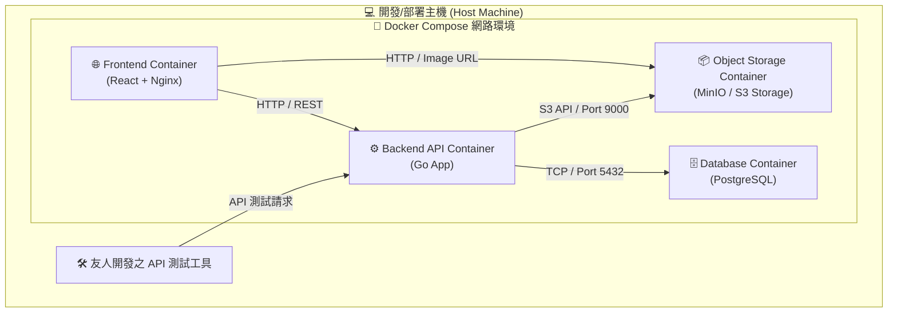
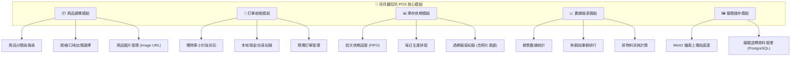
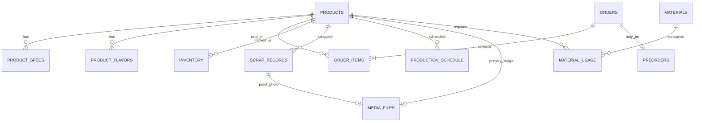
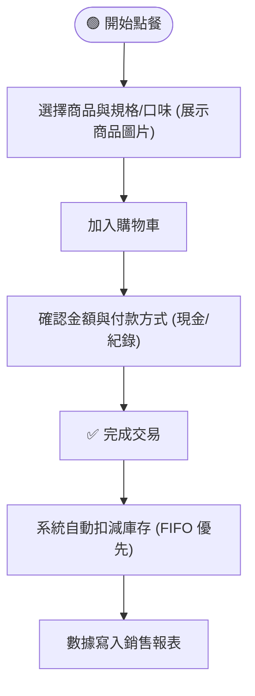
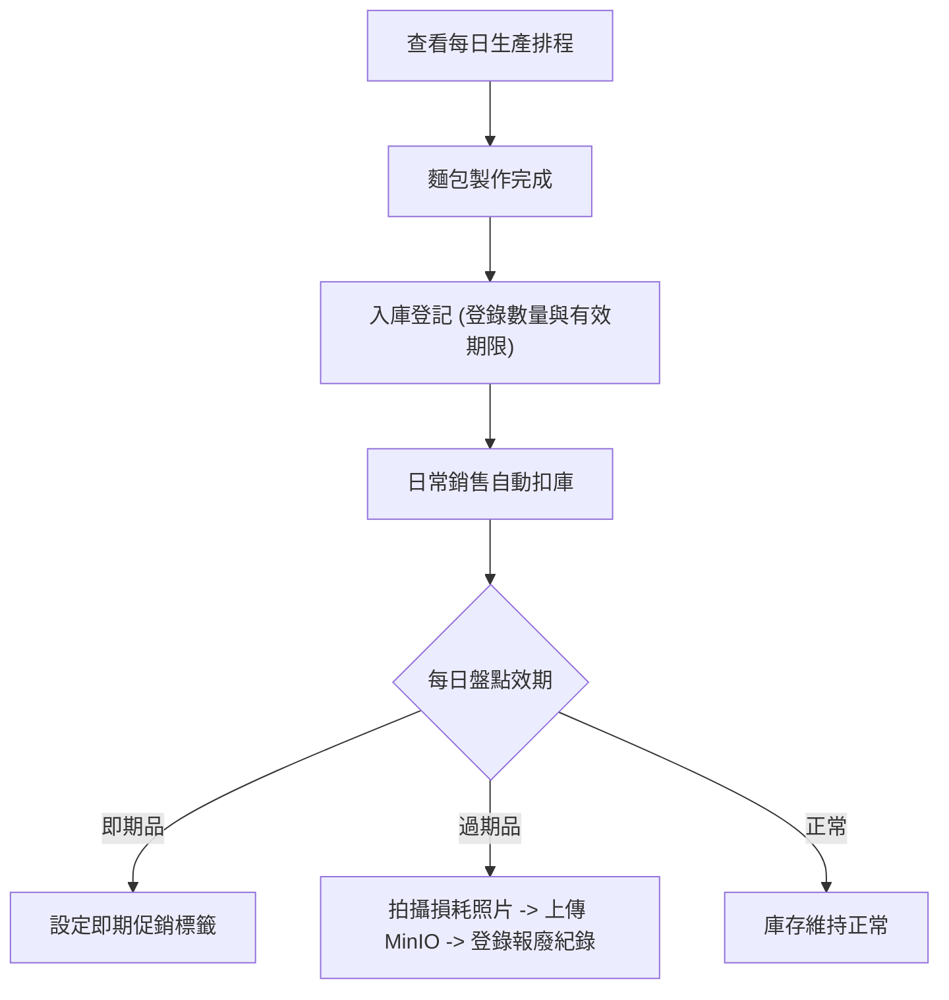

# 🍞 月月麵包坊 POS 系統企劃書 (開發練習版)

## 一、專案概述與練習定位

### 1.1 專案簡介
本專案為 **月月麵包坊 POS 銷售與庫存管理系統**，旨在作為個人全棧 Web 開發與 Docker 容器化部署的實務練習專案。專案重點在於練習現代化 Web 技術棧、資料庫關聯設計、RESTful API 架構與 Docker 容器化技術，**不包含**任何外部金流、銀行串接或第三方 API 服務。

### 1.2 練習重點與範疇
- **全棧架構實作**：前後端分離架構設計與 RESTful API 開發。
- **Docker 容器化建置**：全系統使用 Docker / Docker Compose 進行多容器環境建置與部署管理。
- **核心業務邏輯**：商品規格、購物車結帳、麵包短效期庫存追蹤與損耗/生產報表計算。
- **多媒體資產管理**：整合 MinIO 物件儲存資料庫，管理商品圖片與報廢照片佐證。
- **測試工具**：API 測試階段**不使用 Postman**，改為使用**友人開發之專用 API 測試工具**進行端點連通與業務邏輯驗證。

---

## 二、系統架構與 Docker 容器化規劃

### 2.1 技術棧選型 (Tech Stack)

| 層級 | 技術項目 | 說明 |
|------|----------|------|
| **前端 (Frontend)** | React / Vite | 單頁應用 (SPA)，負責 POS 門市操作介面 |
| **後端 (Backend)** | Go (Golang) | 提供 RESTful API，處理高併發與核心業務邏輯 |
| **關聯式資料庫 (Database)** | PostgreSQL | 關聯式資料庫，儲存商品、訂單、庫存與報表數據 |
| **物件儲存資料庫 (Storage)** | MinIO (S3 相容) | 物件儲存服務，負責商品圖片、報廢照片與多媒體憑證 |
| **容器化 (Container)** | Docker & Docker Compose | 服務容器化管理與一鍵環境啟動 |
| **測試工具 (Testing)** | 友人開發之 API 測試工具 | 代替 Postman，進行 API 端點與業務邏輯測試 |

#### 2.1.1 為何選擇這些技術？(技術選型理由)

1. **前端使用 React + Vite**：
   - **高元件化與靈活性**：POS 點餐介面需要頻繁動態更新（如點擊商品即時顯示於購物車、計算小計），React 的虛擬 DOM (Virtual DOM) 與狀態管理 (State Management) 能提供流暢的互動體驗。
   - **Vite 高速建置**：相較於傳統打包工具，Vite 提供極快的冷啟動與熱重載 (HMR) 速度，非常適合開發練習與迭代。

2. **後端選擇 Go (Golang)**：
   - **高併發與卓越效能**：Go 語言具備極輕量的 Goroutine 協程與高效記憶體管理，天然適合 POS 系統高頻率、低延遲的 RESTful API 請求與併發庫存扣減。
   - **強型別與編譯期嚴謹度**：靜態型別系統與明確的錯誤處理機制，能大幅降低執行期例外，確保核心業務邏輯（金額計算、庫存異動）之穩定與安全。
   - **極致輕量與原生容器化**：Go 可編譯為獨立的高效能二進位檔 (Binary)，建置出的 Docker 鏡像極小且啟動快速，非常適合雲端與容器化部署。

3. **資料庫選用 PostgreSQL**：
   - **資料完整性與 ACID 特性**：POS 系統涉及金額計算、庫存扣減與訂單建立，必須確保交易 (Transaction) 的強一致性，避免超賣或金額計算錯誤。
   - **強大的關聯與 JSON 擴展支援**：支援複雜的 `JOIN` 查詢（如訂單關聯商品與規格），且支援 JSONB 格式，適合儲存彈性的商品規格與發票備註。

4. **圖片與多媒體資料庫選用 MinIO (S3 相容物件儲存)**：
   - **關聯資料與二進位檔案解耦**：若將高解析度商品圖片、報廢佐證照片直接存入 PostgreSQL (如 `BYTEA` 型態)，會導致資料庫體積急速膨脹、備份困難且影響 SQL 查詢效能。選用 MinIO 可使 PostgreSQL 僅需儲存 URL 或 Key，檔案本體則交由高效能的物件儲存服務處理。
   - **S3 API 標準與雲端原生**：MinIO 提供與 AWS S3 完全相容的 SDK 與 API 介面，未來若系統欲轉移至雲端 (如 AWS S3, GCP Cloud Storage)，無須大幅修改程式碼。
   - **Docker 原生管理與 Web 控制台**：透過 Docker Compose 快速一鍵部署，並提供專屬 Web 管理面板 (Port 9001)，方便維運人員預覽與管理上傳之媒體資源。

5. **採用 Docker & Docker Compose**：
   - **跨環境一致性**：解決「在我的電腦上可以執行，在別人電腦上不行」的問題。將前端、後端、PostgreSQL 資料庫與 MinIO 物件儲存獨立打包成容器。
   - **一鍵啟動 (One-Command Up)**：只需執行 `docker-compose up`，即可自動拉取鏡像並組裝全套四層服務，省去手動配置本地環境的繁瑣步驟。
   - **學習產業標準**：Docker 為現代雲端部署與微服務架構的標準技術，是極具價值的實務練習目標。

6. **採用友人開發的 API 測試工具**：
   - **客製化測試需求**：能更精確地符合特定情境測試需求，並檢驗自家/友人開發工具與 API 的相容性與穩定度。

### 2.2 Docker 容器架構設計 (Containerized Architecture)

### 2.3 Docker 服務配置規劃

1. **`pos-frontend`** (前端容器)
   - 基礎鏡像：`node:alpine` (Build) + `nginx:alpine` (Serve)
   - 對外埠口：`80:80`
2. **`pos-backend`** (後端 API 容器)
   - 基礎鏡像：`golang:1.22-alpine` (多階段構建產出輕量鏡像)
   - 對外埠口：`8080:8080` (或 `3000:3000`)
   - 環境變數：資料庫連線字串 (DSN)、MinIO 密鑰、App 密鑰
3. **`pos-db`** (關聯式資料庫容器)
   - 基礎鏡像：`postgres:15-alpine`
   - 對外埠口：`5432:5432`
   - 資料持久化：Docker Named Volume (`postgres_data`)
4. **`pos-storage`** (物件儲存容器)
   - 基礎鏡像：`minio/minio`
   - 對外埠口：`9000:9000` (S3 API 端點) 與 `9001:9001` (Web Console 管理介面)
   - 環境變數：`MINIO_ROOT_USER`, `MINIO_ROOT_PASSWORD`
   - 資料持久化：Docker Named Volume (`minio_data`)

---

## 三、核心業務模組規劃

### 3.1 核心模組功能概要

1. **📦 商品選購模組**：支援商品分類瀏覽、關鍵字搜尋、規格選擇（大/小）、口味加購與**商品圖片 (Image URL) 預覽與上傳**。
2. **🛒 訂單結帳模組**：購物車動態計算、本地交易記錄（模擬現金/自訂支付標記）、預購訂單建立與取貨狀態追蹤。
3. **📊 庫存效期模組**：麵包批次效期管理、先進先出 (FIFO) 推薦、過期報廢登記與**損耗報廢照片憑證上傳 (Photo Proof)** 與每日生產排程。
4. **📈 數據報表模組**：每日/每週銷售統計、暢銷商品排行、銷售量反推原物料消耗分析。
5. **🖼️ 媒體儲存模組 (Media & Storage Module)**：整合 MinIO 物件儲存 API，提供高解析度商品圖檔、損耗證明相片、活動海報等非結構化內容的上傳、預覽與生命週期管理。

---

## 四、資料庫 Schema 與 API 規劃

### 4.1 資料庫關聯圖 (ER Diagram)

### 4.2 核心資料表 (Database Tables)

- `products` (商品主檔): `id`, `name`, `category`, `base_price`, `status`, `image_url`
- `product_specs` (規格): `id`, `product_id`, `spec_name`, `price_diff`
- `product_flavors` (口味): `id`, `product_id`, `flavor_name`, `price_diff`
- `orders` (訂單主檔): `id`, `order_no`, `total_amount`, `payment_type`, `status`, `created_at`
- `order_items` (訂單明細): `id`, `order_id`, `product_id`, `spec`, `flavor`, `qty`, `subtotal`
- `preorders` (預購紀錄): `id`, `order_id`, `customer_name`, `phone`, `pickup_date`, `deposit`
- `inventory` (庫存與效期): `id`, `product_id`, `batch_no`, `qty`, `produced_date`, `expiry_date`
- `scrap_records` (報廢紀錄): `id`, `product_id`, `qty`, `reason`, `scrap_date`, `photo_url`
- `production_schedule` (生產排程): `id`, `product_id`, `planned_qty`, `schedule_date`
- `materials` (原物料): `id`, `name`, `unit`, `stock_qty`, `unit_cost`
- `material_usage` (配方與用量): `id`, `material_id`, `product_id`, `usage_qty`
- `media_files` (媒體與檔案資產表): `id`, `filename`, `bucket_name`, `object_key`, `mime_type`, `size_bytes`, `url`, `created_at`

### 4.3 RESTful API 設計與測試規範

> [!NOTE]
> 本專案所有 API 端點開發完成後，統一使用**友人開發之專用 API 測試工具**進行 Request/Response 測試驗證，不使用 Postman。

| 模組 | 動作 | HTTP 方法 | Endpoint | 說明 |
|------|------|-----------|----------|------|
| **商品** | 取得商品列表 | GET | `/api/v1/products` | 包含分類篩選與規格/圖片 URL |
| | 新增/修改商品 | POST/PUT | `/api/v1/products` | 商品主檔維護 (可設定 image_url) |
| **訂單** | 建立訂單 | POST | `/api/v1/orders` | 結帳並同步扣減庫存 |
| | 查詢訂單歷史 | GET | `/api/v1/orders` | 支援日期與類型查詢 |
| | 建立預購單 | POST | `/api/v1/preorders` | 預約取貨訂單 |
| **庫存** | 登記生產入庫 | POST | `/api/v1/inventory/inbound` | 建立批次與效期 |
| | 登記損耗報廢 | POST | `/api/v1/inventory/scrap` | 記錄損耗原因、數量與照片 URL |
| **媒體儲存** | 上傳圖片/檔案 | POST | `/api/v1/storage/upload` | 上傳至 MinIO 並回傳物件 URL |
| | 取得檔案資訊 | GET | `/api/v1/storage/files/:id` | 查詢檔案 Metadata 與存取連結 |
| | 刪除媒體檔案 | DELETE | `/api/v1/storage/files/:id` | 刪除 MinIO 物件與 DB 紀錄 |
| **報表** | 銷售統計報表 | GET | `/api/v1/reports/sales` | 日/週/月營收統計 |
| | 原料消耗分析 | GET | `/api/v1/reports/materials` | 依銷量反推材料耗損 |

---

## 五、系統營運與庫存流程

### 5.1 點餐結帳與扣庫流程

### 5.2 庫存效期與生產排程流程

---

## 六、開發與部署步驟概覽

1. **環境建置**：安裝 Docker Desktop，撰寫 `docker-compose.yml` (配置 PostgreSQL與 MinIO 容器) 與各服務之 `Dockerfile`。
2. **儲存與資料庫初始化**：建置 PostgreSQL 與 MinIO 容器，執行 SQL Schema Migration，並於 MinIO 自動建立預設 Bucket (如 `yunyue-pos-media`) 與 Access Key。
3. **後端 API 開發**：實作 RESTful API (含檔案上傳與物件儲存 SDK)，並使用**友人開發之 API 測試工具**驗證每個 Endpoint。
4. **前端頁面整合**：使用 React 開發 POS 操作介面，與後端 API 串接並展示商品縮圖與上傳介面。
5. **Docker 全系統集成**：執行 `docker-compose up --build` 驗證四層式 (Frontend, Backend, Database, Storage) 架構運作流暢度。